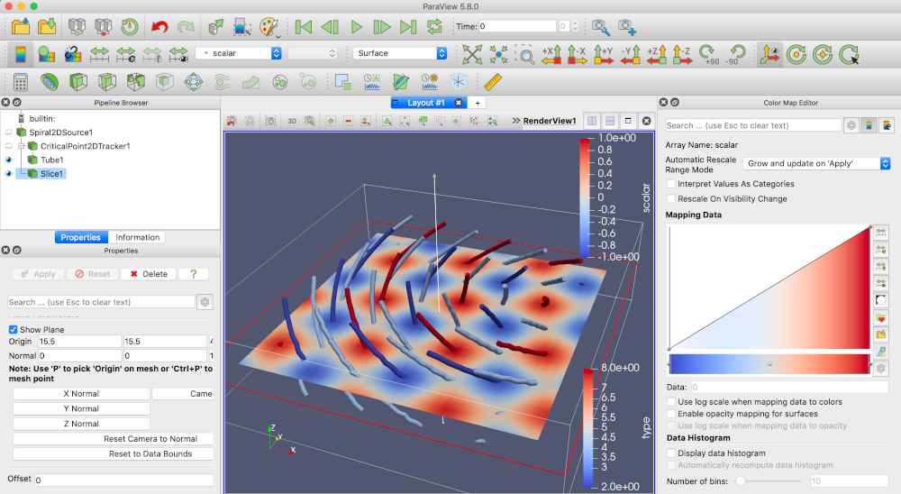
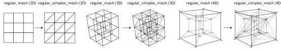

# FTK: The Feature Tracking Kit

[](https://travis-ci.org/hguo/ftk)

FTK is a library that scales, simplifies, and delivers feature tracking algorithms for scientific datasets.  You may use FTK as ParaView plugins, Python bindings, or a command-line interface.   See [arXiv:2011.08697](https://arxiv.org/abs/2011.08697) for more details on our feature tracking algorithms.

See [documentation](docs/README.md) for more details.



## Installation

To install FTK, use `spack install ftk`, `pip install pyftk`, or build from source; see [this page](docs/install.md) for more details on dependencies, compilation, and installation.  

For Windows users only: this code has been developed and tested using MacOS and Linux environments; we have not tried porting functionalities to Windows.  Windows users may use a Linux virtual machine to compile and use FTK; the use of WSL2 has not been tested yet.  Stay tuned.

## FTK command line interface

FTK provides one single executable `ftk`.  See [this page](docs/cli.md) for mor details on the usage of FTK command line interface.

## FTK for ParaView

### Building ParaView plugins

FTK provides ParaView plugins to allow users track critical points (maxima, minima, and saddles) in scalar field data.  In order to build the plugins, we recommend to build and use (ParaView version 5.8.0 and higher required)

```bash
$ git clone https://github.com/hguo/ftk $FTK_SOURCE_DIR
$ mkdir $FTK_SOURCE_DIR/build && cd $FTK_SOURCE_DIR/build
$ cmake .. -DFTK_BUILD_PARAVIEW=ON -DParaView_DIR=$YOUR_ParaView_Build
$ make
```

If built successfully, you will see the plugins binary as `lib/paraview-5.8/plugins/FTK/FTK.so`.  Open the "Plugin Manager" in ParaView, and load this binary with "Load New..." button, and then select and load FTK in the list.  To check if ParaView plugins are correctly built by reproducing the results in the above figure, use "Sources-->FTK-->SpiralWoven2DSource", "Filters-->FTK-->CriticalPointTracker2D",followed by the "Tube" filter in ParaView.

### Using ParaView plugins

We demonstrate the use the 2D critical point tracking filter (`vtkCriticalPoint2DTracker`) with a dataset.  The input of this filter must be a 3D volumetric data that stacks 2D time-varying scalar fields in the Z direction.  In this demo, we first add a synthetic 3D volume data by using Sources / FTK / Spiral2DSource.  We then track the trajectories of 2D critical points with Filters / FTK / CriticalPoint2DTracker.  The output trajectires can be visualized as tubes and color-coded by their types, scalar values, or IDs.  In this demo, the time-varying scalar field is defined in closed form: 

$f(x,y,t)=cos(x\cos t - y\sin t) \sin(x\sin t + y\cos t),$

where $x$ and $y$ are 2D coordinates and $t$ is time.  We discretize the $x,y$ domain into a $128\times 128$ regular grid and the time domain into 10 timesteps.  Local maximum are defined as the loci of points that $(\frac{\partial f}{\partial x}, \frac{\partial f}{\partial x})=0$ and both eigenvalues of the Hessian of $f$ (in terms of $x$ and $y$) are negative.  We use a sweep-and-trace algorithm to first localize local maximum and trace the maximum over space-time.  We first mesh the scalar field with a 3D regular simplex mesh and check every 2-elements (faces) meets the criteria.  We then do the connected component labeling; two faces are connected if each of them has a local maxima and share the same 3-element (tetrahedra).  The trajectories are then constructured from the connected components.  

## FTK for Python (PyFTK)

You can install PyFTK with `pip`.  The only dependency in the current release is `numpy`.  If you would like to build PyFTK from source and use advanced build options, see [this page](docs/install.md).

```bash
$ pip3 install pyftk
```

PyFTK provides synthetic data generators (`pyftk.synthesizers`), feature extractors (`pyftk.extractors`), and feature trackers (`pyftk.trackers`).  Currently, PyFTK only supports critical points.  The following is an example of tracking critical points in a synthetic spiral woven data:

```python
>>> import pyftk
>>> data = pyftk.synthesizers.spiral_woven(10, 10, 20) # generate synthetic spiral woven data (width=10, height=10, and 20 timesteps).  The shape of data is (1, 10, 10, 20)
>>> result = pyftk.trackers.track_critical_points_2d_scalar(data) # track critical points in a scalar field
>>> print(result)
```

The results are trajectories organized in a list: 

```
[{'length': 9, 'trace': [{'x': 2.275077079338536, 'y': 2.0, 't': 2.843946435964648, 'type': 'min', 'scalar': -0.7349697808320285}, {'x': 2.3009922790096073, 'y': 2.057205556154771, 't': 3.0, 'type': 'min', 'scalar': -0.7126261556354363}, {'x': 2.316376550504984, 'y': 2.0789601019629704, 't': 3.0789601019629704, 'type': 'min', 'scalar': -0.6994583185227987}, {'x': 2.3396684290296013, 'y': 2.109042720626548, 't': 3.339668429029601, 'type': 'min', 'scalar': -0.6203974444741183}, ...
```


## FTK C++ Libraries

You may use FTK as a C++ library.  The installation will also generate FTKConfig.cmake in the installation path, such that you can use `find_package(FTK)` to find and use FTK in your CMakeLists.txt

```bash
$ git clone https://github.com/hguo/ftk $FTK_SOURCE_DIR
$ mkdir $FTK_SOURCE_DIR/build && cd $FTK_SOURCE_DIR/build
$ cmake .. -DCMAKE_INSTALL_PREFIX=$FTK_INSTALL_DIR
$ make install
```

#### Including FTK in your CMake project

You may use the FTK installation in your own CMakeLists.txt file:

```cmake
find_package(FTK REQUIRED)
include_directories (${FTK_INCLUDE_DIR})
target_link_library (${YOUR_TARGET} FTK::libftk)
```

Specify FTK_DIR with CMake: 

```bash
$ cmake -DFTK_DIR=$FTK_INSTALL_DIR/lib/cmake
```

### FTK library components

* Hypermesh: data structures for high-dimensional meshes and mesh elements including *n*-simplices, *n*-cubes, and *n*-prisms; utilities to generalize given 2D/3D structured/unstructured meshes into 3D/4D spacetime meshes



* Numeric: root-find algorithms for inverse interpolations and parallel vector operators in *n*-simplices, *n*-cubes, and simplex-prisms; lightweight linear algebra utilities to support root-finding
* CCL: connected component labeling algorithm for building feature tracking algorithms
* Geometry: utilities to transform connect components to geometry for visualization and analysis
* Tracking graph: data structures to record births, deaths, merges, and splits of features; visualization algorithms for tracking graphs

## Contact

* [Hanqi Guo](http://www.mcs.anl.gov/~hguo/), [hguo@anl.gov](mailto:hguo@anl.gov)

## Publications

* Hanqi Guo, David Lenz, Jiayi Xu, Xin Liang, Wenbin He, Iulian R. Grindeanu, Han-Wei Shen, Tom Peterka, Todd Munson, and Ian Foster, "FTK: A Simplicial Spacetime Meshing Framework for Robust and Scalable Feature Tracking." IEEE Transactions on Visualization and Computer Graphics, 27(8):3463-3480, 2021. [arXiv:2011.08697](https://arxiv.org/abs/2011.08697) [cs.GR]

* Jiayi Xu, Hanqi Guo, Han-Wei Shen, Mukund Raj, Xueqiao Xu, Xueyun Wang, Zhehui Wang, and Tom Peterka, "Asynchronous and Load-Balanced Union-Find for Distributed and Parallel Scientific Data Visualization and Analysis." IEEE Transactions on Visualization and Computer Graphics (Proc. IEEE PacificVis 2021), 27(6):2808-2820, 2021. [arXiv:2003.02351](https://arxiv.org/abs/2003.02351) [cs.DC]
