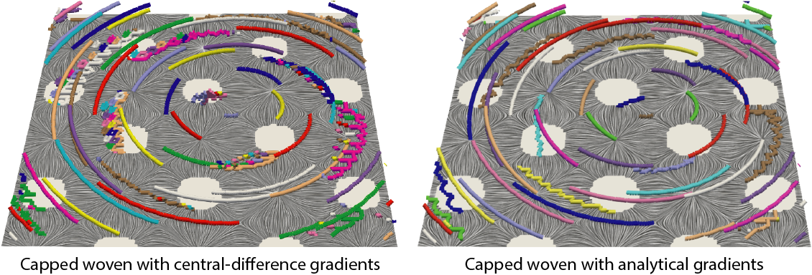

# Tutorial: Critical Point Tracking with FTK

Critical points---vanishing locations in a vector field---are the most important family of features in scientific data.  Critical points are the key constitiuents of vector field topology and essentially determine the characteristics of flow transport such as sources, sinks, and saddles.   Critical points are also in the gradient field of scalar functions, representing minimum, maximum, and saddles in a scalar field.  Read [this preprint](https://arxiv.org/abs/2011.08697) for more details on critical point tracking in FTK. 

## Our method

### Critical point extraction

We use a numerical method to locate critical points in the input vector field data.  Without the loss of generality, we describe the case of 2D vector fields and assume the vector field is *piecewise linear* (PL), which implies that the data defined on a simplicial (triangular) mesh.  We will discuss how our method adapt to non-simplicial meshes in following sections.  

To extract critical points in a 2D PL vector field, one can iterate each triangular cell and test if the cell encircles a critical point.  Let $\mathbf{v}_0, \mathbf{v}_1, \mathbf{v}_2\in\mathbb{R}^2$ be the vector values at three vertices and $(\mu_0, \mu_1, \mu_2)$  be the *barycentric coordinates* of the critical point, that is, $\mu_0\mathbf{v}_0 + \mu_1\mathbf{v}_1 + \mu_2\mathbf{v}_2=\mathbf{0}$; the test is postive the barycentric coordiantes are inside the triangle ($\mu_i\in[0,1], i=0, 1, 2$).  Each triangular cell contains up to one critical point.  The 2D Cartisian location of this critical point may be further derived based on the barycentric coordiantes.  

In addition to the location, the type of critical point are determined by the eigensystem of the Jacobian/Hessian of the input vector/scalar field.  In scalar fields, possible types include minimum, maximum, and saddles; in vector field, possible types include (stable and unstable) attracting, repelling, and saddle types depending on the dimensionality and eigenvalue distributions.  See literature for more information on critical point types. 

### Critical point tracking

We generalize the above critical point extraction to tracking by assuming that the vector field is piecewise linear over 3D/4D spacetime domain.  For example, a time-varying 2D vector field can be descritized into a 3D simplicial (tetrahedral) spacetime mesh; two of the 3D dimensions are space with the third dimension being time.  The new mesh generalizes the original spatial mesh into spacetime while tesselating spacetime elements into simplices (see [this page](hypermesh.md) for more details on our high-dimensional simplicial meshes).  As such, for a given spatiotemporal location $(\mathbf{x}, t)$, the vector value can be linearly interpolated by the four vertices of the residing 3D tetrahedron.  Likewise, we represent a time-varying 3D vector field with a 4D simplicial mesh; each 4D cell (a.k.a 5-cell, 4-simplex, or pentchoron) is a 4D simplex and can be used to interpolate the vector field.  In either 2D or 3D vector field, we use a two-pass algortihm to reconstruct the trajecotroy of critical points, as described below. 

In the first pass, we use the aforementioned critical point test ($\mu_0\mathbf{v}_0 + \mu_1\mathbf{v}_1 + \mu_2\mathbf{v}_2=\mathbf{0}$ and $\mu_i\in[0,1], i=0, 1, 2$) to determine if every triangular cell contains a critical point.  The only difference is that every triangular face in the 3D spacetime mesh, as opoosed to triangular cells in the original 2D mesh, is tested.

In the second pass, we connect two triangles if they both test positive and belong to the same tetrahedron.  Based on the spacetime piecewise linear assumption, *critical point trajectories* are 1D closed curves in spacetime, and each spatiotemporal tetrahedron has up to two triangular faces that are test positive.  The trajectories can be thus reconstructed by storing the spatiotemporal coordinates of each critical point.

### Examples

See Section 4 of [this preprint](https://arxiv.org/abs/2011.08697).  More details are forthcoming. 

### Known issues

#### Gradients of scalar field

In the case of critical point tracking in scalar fields, one has to use the derived gradient fields as the input, which may cause artifacts depending on the quality of gradients.  The spacetime PL gradient field implies $C^2$ continuity of the original scalar field (this is different from topology methods, which assume PL scalar field and identify critical points at vertices of the mesh).  The outputs may be distorted because of the smoothness of differentiation kernels used for gradient derivation (e.g. central differences).  Being said, the output trajectories are as accurate as the quality of the gradient field and how close the scalar field is to $C^2$ continuity.

The following are the critical point tracking results in the "capped" spiral woven data.  The input values are bounded by the maximum value of 0.5, generating plateaus in the scalar field.  On the left are results based on central-difference gradient estimates, and on the right are based on analytical gradients.  Both results handles degeneracies, but we see artifacts (e.g. loops and zigzag trajectories) in the left figure, which are unseen in the right figure.  The ParaView state file to reproduce this case is available [here](pvsm/capped-woven.pvsm) (FTK plug-ins and SurfaceLIC plug-ins required). 

## Further readings

* Hanqi Guo, David Lenz, Jiayi Xu, Xin Liang, Wenbin He, Iulian R. Grindeanu, Han-Wei Shen, Tom Peterka, Todd Munson, Ian Foster, "FTK: A High-Dimensional Simplicial Meshing Framework for Robust and Scalable Feature Tracking." [arXiv:2011.08697](https://arxiv.org/abs/2011.08697), in preprint, 2020