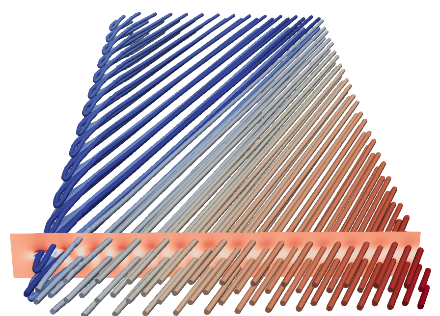

# Example: Tracking critical points in a flow-past-cylinder dataset



This example demonstrates the use of C++ APIs to track critical points in this flow-past-cylinder dataset, which is made publicly available by [Tino Weinkauf](https://www.csc.kth.se/~weinkauf/).  One can find the information of the dataset from this webpage: https://www.csc.kth.se/~weinkauf/notes/cylinder2d.html; restrictions of this dataset may apply.  The data are in the AmiraMesh format, which is currently not fully supported by FTK's CLI and bindings.  This example requires one to build the FTK library with VTK.

We recommend the use of CMake as the build system when using the FTK library. 

## CMakeLists.txt

One needs to use the `find_package` function to find the FTK library.  Remember to link the executable to `FTK::libftk`.  

```cmake
cmake_minimum_required(VERSION 3.17)
project (ftk-cylinder2D)

find_package (FTK REQUIRED)

add_executable (ftk-cylinder2D cylinder2D.cpp)
target_link_libraries (ftk-cylinder2D FTK::libftk)
```

Run the CMake executable to build the example.

```bash
$ cmake .. -DFTK_DIR=/path/to/ftk/installation/lib/cmake/FTK
```

# cylinder2D.cpp

```c++
#include <ftk/ndarray.hh>
#include <ftk/filters/critical_point_tracker_2d_regular.hh>
  
// This code reads Cylinder2D.am, writes the vector field data into 
// vtkImageData (.vti) file for visualization, tracks critical points 
// in the data, and writes the critical point trackign results into 
// the designated vtkPolyData (.vtp) file.
//
// Information and the Cylinder2D.am data file may be found in the 
// following web page: https://www.csc.kth.se/~weinkauf/notes/cylinder2d.html
// Follow the copyright information in the web page; Restrictions may apply.  

int main(int argc, char **argv)
{
  // The following section initializes MPI through DIY.  The code should 
  // build and run without MPI.
  diy::mpi::environment env;   
  diy::mpi::communicator comm;

  // Print help information
  if (argc < 4) {
    fprintf(stderr, "Usage: %s <path_to_cylinder_2d_am> <output.vti> <output.vtp>\n", argv[0]);
    return 1;
  }

  // The entire spacetime volume (400x50x1001) will be read into the array
  // Note that the dimension of the array is 2x400x500x1001, with the first
  // dimension x- and y-components of the time-varying vector field
  ftk::ndarray<float> array;
  array.read_amira(argv[1]);
  array.to_vtk_image_data_file(argv[2]);
 
  // Get the width, height, and time dimensions of the domain
  const size_t DW = array.dim(1), DH = array.dim(2), DT = array.dim(3);

  // Derive the average velocity as the frame-of-reference for critical 
  // point tracking
  double ave_u = 0.0, ave_v = 0.0;
  for (int k = 0; k < DT; k ++)
    for (int j = 0; j < DH; j ++)
      for (int i = 0; i < DW; i ++) {
        ave_u += array(0, i, j, k);
        ave_v += array(1, i, j, k);
      }
  ave_u = ave_u / (DW * DH * DT);
  ave_v = ave_v / (DW * DH * DT);

  // Initialze the tracker.  The domain leaves out one cell on the boundary 
  // because Jacobians are evaluated by central differences
  ftk::critical_point_tracker_2d_regular tracker( comm );
  tracker.set_domain( ftk::lattice({1, 1}, {DW-2, DH-2}) ); 
  tracker.set_array_domain( array.get_lattice() );
  tracker.set_scalar_field_source( ftk::SOURCE_NONE ); // no scalar field
  tracker.set_jacobian_field_source( ftk::SOURCE_DERIVED );
  tracker.set_jacobian_symmetric( false ); // Jacobians are asymmetric
  tracker.initialize();

  // Feed time-varying data into the tracker
  for (int k = 0; k < DT; k ++) {
    ftk::ndarray<double> data = array.slice_time(k);

    // Use the average velocity as the frame-of-reference
    for (int j = 0; j < DH; j ++)
      for (int i = 0; i < DW; i ++) {
        data(0, i, j) -= ave_u;
        data(1, i, j) -= ave_v;
      }

    // Push the current timestep
    tracker.push_vector_field_snapshot(data);

    // Start tracking until two timesteps become available
    if (k != 0) tracker.advance_timestep();
  }
  tracker.finalize();

  // Write results
  tracker.write_traced_critical_points_vtk(argv[3]);

  return 0;
}
```

## Run the executable

```bash
$ ftk-cylinder2D ~/Downloads/Cylinder2D.am cylinder2d.vti cylinder2d.vtp
```

## Visualize the outputs

Open `cylinder2d.vti` and `cylinder2d.vtp` with ParaView.  You may also download this ParaView state file to reproduce the visualization, given that both output files are reachable by ParaView: [cylinder2D.pvsm](pvsm/cylinder2D.pvsm).

