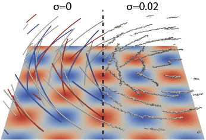
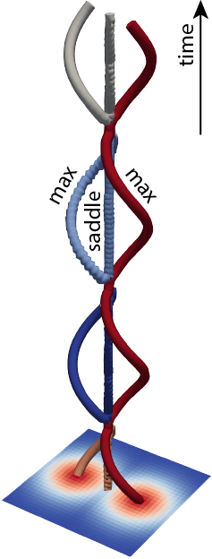
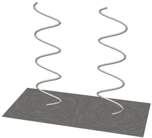

# Synthetic data

We provide a number of options to produce synthetic data for tutorial and testing purposes.  These synthetic data are generated on-the-fly and consumed by feature tracking algorithms.

## Usage

### Using synthetic data sources with FTK command line interface

One can use synthetic data sources (`--synthetic`) in lieu of real data (`--input`) when executing `ftk`.   The following example tracks critical points (`-f cp`) in a 32-timestep 3D scalar field dataset, which contains one single minimum in a $32^3$ regular grid mesh; the default initial location of the minimum is $x_0=(10, 10, 10)$, and the point moves $dir=(0.1, 0.11, 0.1)$ per tilmestep: 

```bash
$ ftk -f cp --synthetic moving_extremum_3d --width 32 --height 32 --depth 32 --timesteps 32 --output out.txt
```

To configure parameters including $x_0$ and $dir$, use the following `moving_extremum_3d.json` description file in the JSON format: 

```json
{
  "type": "synthetic",
  "name": "moving_extremum_3d",
	"dimensions": [32, 32, 32],
	"x0": [10,10,10],
  "dir": [0.1, 0.11, 0.1],
  "n_timesteps": 32
}
```

and then execute

```bash
$ ftk -f cp --input moving_extremum_3d.json --output out.txt
```

A complete list of synthetic data sources including parameters are introduced in the rest of this document.

### Using FTK synthetic data sources in ParaView

One can find the list of FTK synthetic data sources in the "Sources --> FTK" menu.  These data sources can be combined with 

### Using FTK synthetic data sources in Python

Here's an example of using `pyft.synthesizers`: 

```python
import pyftk
data = pyftk.synthesizers.moving_extremum(11, 13, 20, 5, 5, 0.1, 0.2)
result = pyftk.trackers.track_critical_points_2d_scalar(data)
```

### Using FTK synthetic data sources in C++

C++ functions are available to generate synthetic data in `ndarray` data structures.  See more details in `ftk/ndarray/synthetic.hh`

## Definitions



#### Spiral woven (time-varying 2D scalar field data)

The spiral woven function is defined as $f(x,y,t)=cos(x\cos t - y\sin t) \sin(x\sin t + y\cos t),$ where where $x$ and $y$ are 2D coordinates and $t$ is time.  The image of this data rotates counterclockwise over time.  In the regular grid domain, $x$ and $y$ coordinates are scaled by the `scalaing_factor`, and the rotation center sits on the center of the image.  This dataset is used to test critical point tracking in 2D regular-grid scalar field data. 

##### Parameters

* `scalaring_factor` (by default 15.0) scales $x$ and $y$ coordinates in the 2D regular grid and controls the density of woven
* `dimensions` (by default `[32, 32]`)

##### Example

In the right figure, we demonstrate critical point tracking results with/without the presence of noise injection.  For example, the following command injects Gaussian noise ($\sigma=0.02$) to the synthetic woven data:
```bash
$ ftk -f cp --synthetic woven --perturbation 0.02 --output woven-0.02.vtp
```


#### Merger (time-varying 2D scalar field data)



The merger function is defined as $f(x,y,t)=\max(e^{-\hat{x}(t)^2-\hat{y}(t)^2}, e^{-\tilde{x}(t)^2-\hat{y}(t)^2})$, with $\hat{x}(t)=(x-\sin(t-2\pi))\cos(t)-y\sin(t)$, $\hat{x}(t)=(x-\sin(t+2\pi))\cos(t)-y\sin(t)$, and $\hat{y}(t)=x\sin(t)+y\cos(t)$, which is a combination of periodical rotation and translation motions.  The dataset is used to test critical point tracking with split and merge behaviors in 2D regular-grid scalar field data.

##### Parameters

* `dimensions` (by default `[32, 32]`)
* `n_timesteps` (by default 100)

##### Example

To reproduce the results in the right figure, use the following command line:
```bash
$ ftk -f cp --synthetic merger_2d --output merger_2d.vtp --no-post-processing
```
Note that the `--no-post-processing` option prevents trajectories being split into sub-trajectories with consistent types.

#### Double gyre (time-varying 2D vector field data)

The double-gyre function is proposed by [Shadden et al.](https://shaddenlab.berkeley.edu/uploads/LCS-tutorial/examples.html) and is used to study Lagrangian coherent structures in time-dependent dynamical systems.  See the above link for more details.  We use this dataset to test critical point tracking in 2D regular- and unstructured-grid vector field data.

##### Example

To reproduce the results in the right figure, use the following command line:
```bash
$ ftk -f cp --synthetic merger_2d --output merger_2d.vtp --no-post-processing
```
Note that the `--no-post-processing` option prevents trajectories being split into sub-trajectories with consistent types.


##### Parameters

* `dimensions` (by default `[64, 32]`)
* `n_timesteps` (by default 50)
* `time_scale` (by default 0.1) defines how discrete timestep is mapped to time: t = time_scale * timestep

#### Moving extremum 2D (time-varying 2D scalar field data)



The moving extremum 2D function is defined as $f(x, y, t)=(x-x_0)^2 + (y-y_0)^2$, where $(x_0, y_0)$ are the coordinates of the minimum and moves along the designated direction over time.  This dataset is used to test critical point tracking in 2D regular-grid scalar field data. 

##### Parameters

* `x0` (by default `[10, 10]`)
* `dir` (by default `[0.1, 0.1]`)
* `dimensions` (by default `[64, 32]`)
* `n_timesteps` (by default 50)

##### Example

To reproduce the results in the right figure, use the following command line:
```bash
$ ftk -f cp --input double_gyre.json --output double_gyre.vtp
```
The contents of `double_gyre.json` are
```json
{
  "type": "synthetic",
  "name": "double_gyre",
  "dimensions": [64,32],
  "n_timesteps": 50,
  "time_scale": 2.0
}
```


#### Moving extremum 3D (time-varying 3D scalar field data)

Similar to the moving extremum 2D data, the 3D version is defined as $f(x, y, z, t)=(x-x_0)^2 + (y-y_0)^2 + (z-z_0)^2$ and contains one single minimum at $(x_0, y_0, z_0)$.  This dataset is used to test critical point tracking in 3D regular-grid scalar field data. 

##### Parameters 

* `x0` (by default `[10, 10, 10]`)
* `dir` (by default `[0.1, 0.11, 0.1]`)
* `dimensions` (by default `[21, 21, 21]`)
* `n_timesteps` (by default 32)

#### Moving ramp 3D (time-varying 3D scalar field data)

The 3D moving ramp function is defined as $f(x,y,z,t)=x - (x_0 + rate*t)$, where $x_0$ moves at the designated speed over time.  This dataset contains no critical point and used to test 3D isosurface tracking in regular-grid scalar field.

##### Parameters

* `x0` (by default 10)
* `rate` (by default 0.1) defines the the changing rate of $x_0$.

* `dimensions` (by default `[21, 21, 21]`)
* `n_timesteps` (by default 32)

#### Moving dual ramp 3D (time-varying 3D scalar field data)

The dual ramp is defined as $f(x,y,z,t)=|x-x_0|-rate*t$.  The purpose is to test 3D isosurface tracking in regular-grid scalar field.

* `x0` (by default 10)
* `rate` (by default 0.1) defines the the changing rate of $x_0$.
* `offset` (by default 2.0)

* `dimensions` (by default `[21, 21, 21]`)
* `n_timesteps` (by default 32)

